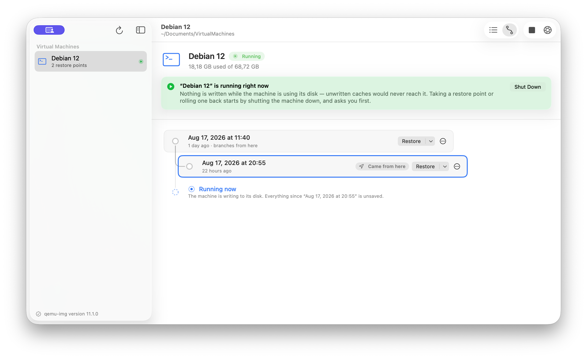

# UTM Snapshot Manager

[](https://github.com/nurkert/UTM-Snapshot-Manager/actions/workflows/ci.yml)
[](https://github.com/nurkert/UTM-Snapshot-Manager/releases)
[](#requirements)
[](LICENSE)

Restore-point management for [UTM](https://mac.getutm.app) virtual machines, as a native macOS
application.

UTM has no snapshot interface of its own; the feature request was
[closed as *not planned*](https://github.com/utmapp/UTM/issues/6020). The QEMU backend beneath
it does support snapshots on `qcow2` disks — it simply has no face. This is that face, built
for repeated use rather than the occasional rescue: mark a known-good state, work, and return
to it in one confirmed operation.



---

## Why it exists

Rolling a virtual disk back is destructive and irreversible. A tool that does it has exactly
one job beyond the mechanics: never do it to a machine that is in use, and never do it to the
wrong machine. Both are easier to get wrong than they look.

- A machine that is **paused** looks stopped to the process table, and writing to it corrupts
  the guest file system just as thoroughly as writing to a running one.
- A **duplicated** `.utm` bundle carries the original's identifier. Acting on the identifier
  alone means a backup in `Downloads` can shut down the machine you are actually using.
- A machine with **several disks** must be rolled back as one unit, or the guest boots with
  its disks at different points in time.

This application treats those three as correctness requirements, not edge cases. The
reasoning, the failure modes and the limits are written down in
[docs/security-model.md](docs/security-model.md).

---

## Capabilities

| Area | What it does |
| --- | --- |
| **Discovery** | Finds `.utm` bundles automatically — UTM's own container, Documents, Downloads, Desktop. No configuration, no manual registration. |
| **Restore points** | Create, restore and delete across every disk of a machine as a single unit. |
| **Baselines** | Mark one point as the machine's reference state and return to it with a single action, shutdown and restart included. |
| **Branching view** | Restore points shown as the tree they form, with the machine's current position marked. |
| **Machine control** | Start, shut down and suspend through UTM's scripting interface, and jump to the selected machine in UTM for everything else. |
| **Notes** | A restore point carries why it exists — the ticket, the sample, the build under test. |
| **Diagnostics** | Read-only image integrity check (`qemu-img check`) across all disks. |
| **Export** | Write a machine out as a complete, startable `.utm` at one restore point, optionally as a single compressed archive. The source is only read. |
| **Keyboard** | Every action has a menu entry and a shortcut. |

---

## Requirements

| | |
| --- | --- |
| **Operating system** | macOS 14 or newer |
| **QEMU** | `qemu-img` — `brew install qemu`. The app guides you through it if missing. |
| **UTM** | Optional for restore points. Required for starting and stopping machines from here. |
| **Backend** | QEMU-backed machines. Apple Virtualization uses a disk format without snapshots; those machines are listed and marked unsupported. |

---

## Installation

**Disk image** — download from [Releases](https://github.com/nurkert/UTM-Snapshot-Manager/releases),
drag to Applications, then right-click the app once and choose **Open**. The build is signed
ad-hoc rather than with a paid Apple Developer ID, so the first launch needs that
confirmation.

**From source:**

```sh
git clone https://github.com/nurkert/UTM-Snapshot-Manager.git
cd UTM-Snapshot-Manager
./install.sh
```

The script installs missing prerequisites via Homebrew, builds a universal binary and places
it in `/Applications`.

### Permissions requested on first launch

| Permission | Why | If denied |
| --- | --- | --- |
| Documents, Downloads, Desktop | Locating machines | Machines in those folders stay invisible; the app says so and links to the setting. |
| Automation → UTM | Determining whether a machine is running | The app cannot confirm a machine is idle and refuses to write to any disk. |
| Data from other apps | Reading UTM's library to tell a bundle from a copy of it | Start and stop are unavailable; restore points continue to work. |

Each is requested for a stated reason, and each degrades to a safe, explained state rather
than to a guess.

---

## Documentation

| Document | Contents |
| --- | --- |
| [Security model](docs/security-model.md) | What the application guarantees, how each guarantee is enforced, and where it stops. |
| [Architecture](docs/architecture.md) | Layering, data sources, concurrency and the reasoning behind them. |
| [Development](docs/development.md) | Building, testing, releasing and the CI pipeline. |

---

## Verification

Every push runs the full suite on a clean machine:

```sh
Scripts/run-tests.sh      # 42 integration tests against real qcow2 images
Scripts/build-app.sh      # universal Release build, ad-hoc signed
Scripts/make-dmg.sh       # verified disk image
```

The tests are deliberately not mocked. The subject of this application is what `qemu-img`
actually does to a disk, and a stubbed `qemu-img` would only test the stub. They cover the
refusals as thoroughly as the successful paths — an incomplete restore point being rejected
before anything is written, a failed multi-disk create rolling back without residue, a
snapshot name containing shell metacharacters being stored rather than executed.

---

## Relationship to the upstream project

A fork of [Metamogul/UTM-Snapshot-Manager](https://github.com/Metamogul/UTM-Snapshot-Manager),
rewritten. The original was explicitly a proof of concept.

| Upstream | Here |
| --- | --- |
| Machines added manually, sorted into groups | Discovered automatically |
| Running machines flagged in the README | State obtained from UTM, polled, and re-checked before every write |
| Snapshot list parsed from `qemu-img` text output | Parsed from `--output=json` |
| Disks located by scanning for `*.qcow2` | Read from the machine's `config.plist` |
| Restore was irreversible | Safety snapshot, mandatory on multi-disk machines |
| No machine control | Start, shut down and suspend via UTM |
| No export | A complete, startable machine at any restore point |
| No automated tests | 42 integration tests, run on every push |

---

## Support and contributing

Issues and pull requests are welcome at
[nurkert/UTM-Snapshot-Manager](https://github.com/nurkert/UTM-Snapshot-Manager).

When reporting a problem, the most useful details are the macOS and UTM versions, whether the
machine is QEMU- or Apple-backed, how many disks it has, and the exact wording of any message
the application showed. Output from `Scripts/run-tests.sh` is helpful for anything that looks
like a snapshot-handling fault.

## License

Apache 2.0, as the upstream project. See [LICENSE](LICENSE).
